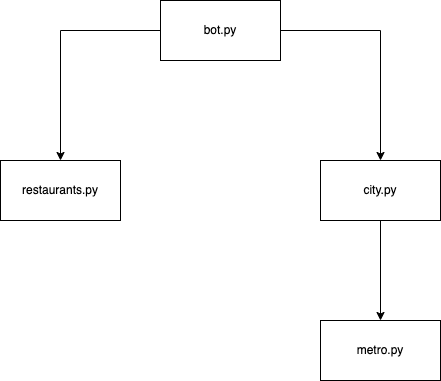
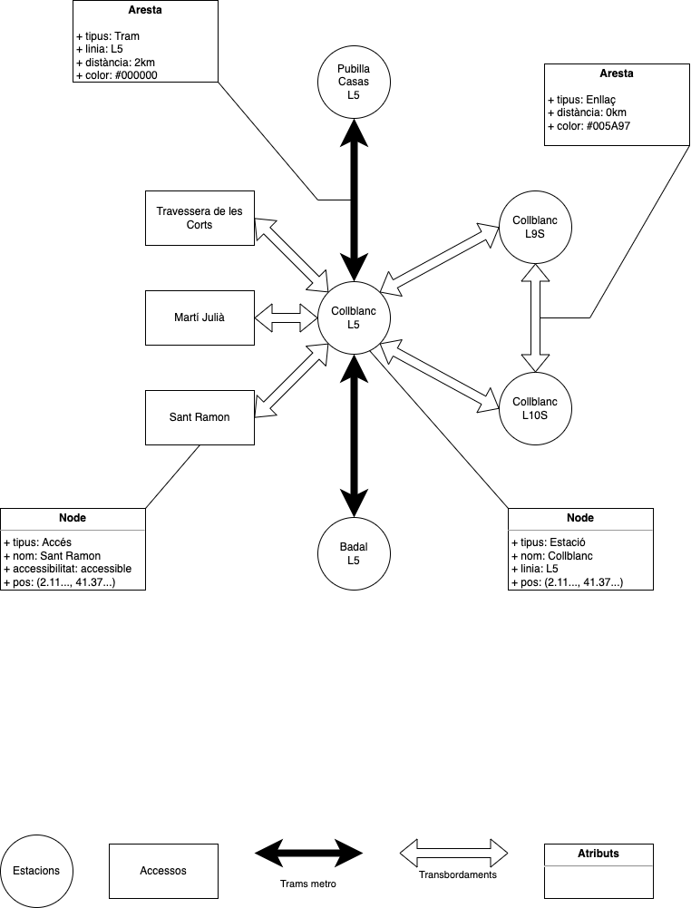
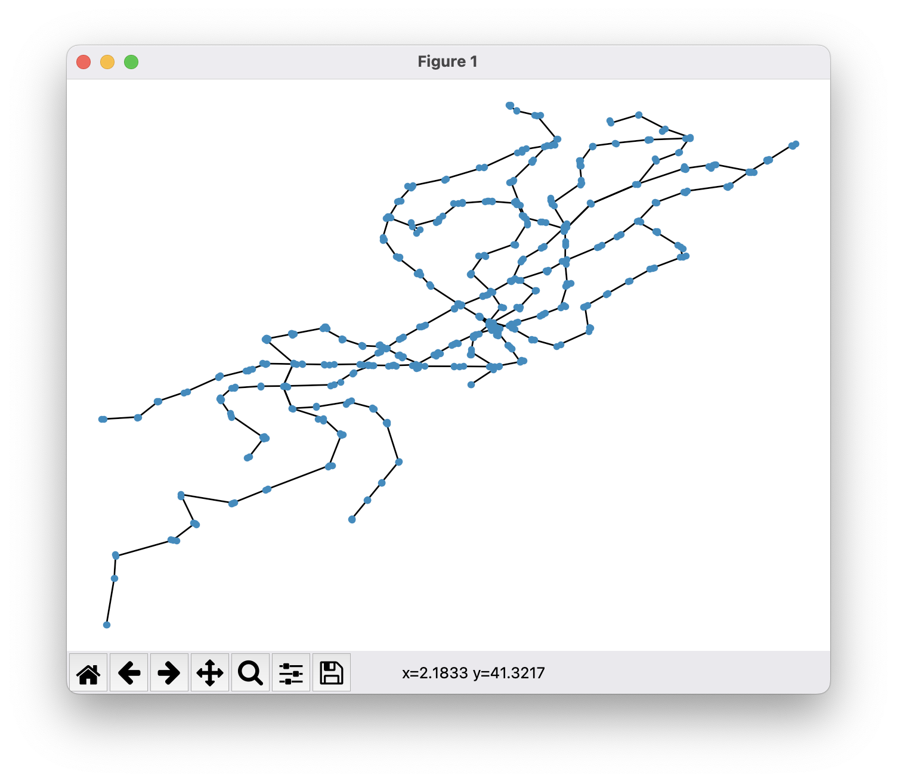
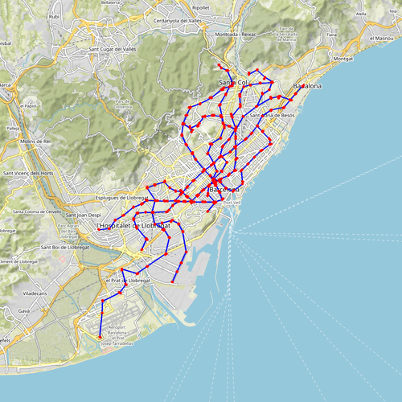
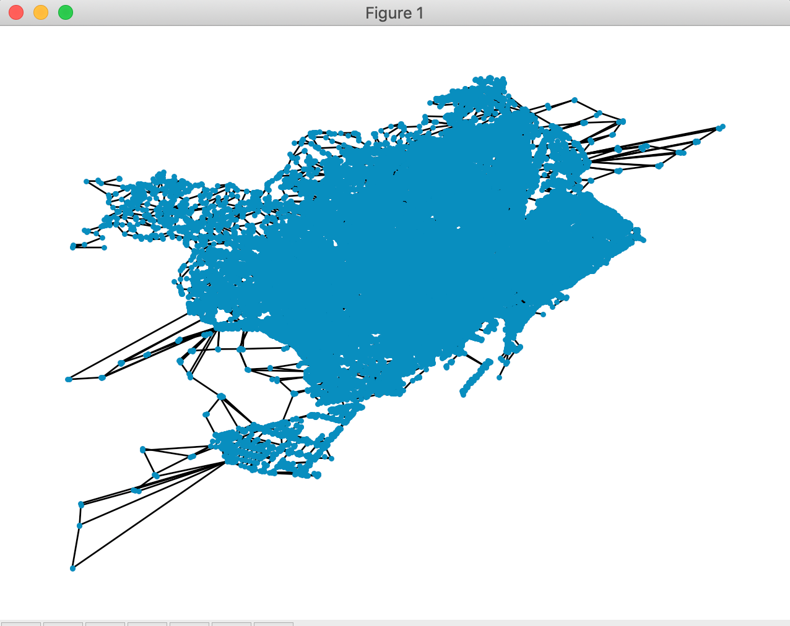
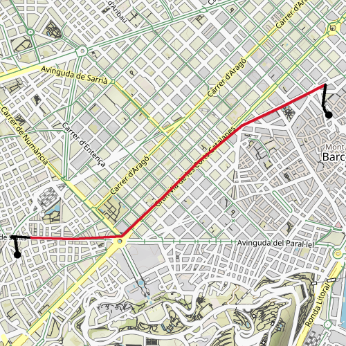

# MetroNyan

*Tria restaurant i vés-hi en metro!* 🍕 🚇


## Dubtes freqüents, aclariments i comentaris

- [13/05/2022]: Afegim un vídeo creat per en Benet Ramió i en Carlos Arbonés amb un exemple de sessió amb el seu Bot. El vídeo és perquè us feu una idea de com queda el producte al final, no cal que ho feu tot igual que en aquest exemple, hi ha moltes coses que es poden fer diferents.
- [05/05/2022]: Hem canviat a l'enunciat que els fitxers CSV s'han de tenir a l'ordinador enlloc de la xarxa.
- [05/05/2022]: Per llegir els CSV amb `pandas`, segurament us cal la opció `encoding='latin1'` perquè la codificació dels accents és "vella".
- [06/05/2022]: Hem actualitzat a l'enunciat la definició dels àlies de tipus perquè el `mypy` no doni errors. Haureu d'importar `TypeAlias` del mòdul `typing_extensions` (amb versions 3.9 i anteriors de python) i del mòdul `typing` (amb versions posteriors de python).
- [06/05/2022]: No useu el mòdul `pep8` que es vell i no entén els tipus, useu  `pycodestyle` al seu lloc.
- [10/05/2022]: Si a l'implementar el bot us dóna aquest error: "cannot schedule new futures after interpreter shutdown" heu d'afegir després de `updater.start_polling()` una crida a `updater.idle()`. Hem actualitzat les lliçons del jutge amb aquesta nova API.

## Introducció

Aquesta pàgina descriu el projecte MetroNyan, que correspon a la segona pràctica del curs 2022 d'AP2 al GCED. La vostra tasca consisteix en implementar un Bot de Telegram que permeti als barcelonins trobar restaurants d'acord a les seves preferències i ensenyar-los com arribar-hi el més ràpid possible en desplaçaments en metro i a peu.

Aquí  podeu veure un exemple d'ús de l'aplicació (gentil·lesa de Benet Ramió i Carlos Arbonés):

[](https://www.youtube.com/watch?v=MGvC0FB5nd8)

Per realitzar aquesta pràctica haureu d'utilitzar aquestes dades:

- El mapa dels carrers de Barcelona obtingut d'[Open Street Map](https://www.openstreetmap.org).

- La [llista d'equipaments de restaurants de la ciutat de Barcelona](https://opendata-ajuntament.barcelona.cat/data/ca/dataset/equipament-restaurants).

- La [Llista de les estacions de Metro de TMB](https://developer.tmb.cat/data/estacions).

- La [Llistat dels accessos de Metro de TMB](https://developer.tmb.cat/data/accessos).


## Arquitectura del sistema

Els sistema consta dels mòduls següents:

- `restaurants.py` conté tot el codi relacionat amb la l'obtenció de la llista de restaurants i cerques relacionades.

- `metro.py` conté tot el codi relacionat amb la construcció del graf de metro.

- `city.py` conté tot el codi relacionat amb la construcció del graf de ciutat i la cerca de rutes entre punts de la ciutat.

- `bot.py` conté tot el codi relacionat amb el bot de Telegram i utilitza els mòduls `city` i `restaurants`. La seva tasca és reaccionar a les comandes dels usuaris per poder-los guiar. 

Els diagrama de mòduls següents mostra les relacions d'ús entre aquests mòduls:




## Mòdul `restaurants`

La funció principal d'aquest mòdul és llegir les dades relatives als restaurants disponibles a https://opendata-ajuntament.barcelona.cat/data/ca/dataset/equipament-restaurants i cercar-les. 

La informació de cada restaurant s'ha de desar en una dada de tipus `Restaurant` i una llista de `Restaurant` és de tipus `Restaurants`:

```python3
@dataclass 
class Restaurant: ...

Restaurants : TypeAlias = List[Restaurant]
```

La funció `read` ha de descarregar i llegir el fitxers de restaurants i retornar-ne la seva llista:

```python3
def read() -> Restaurants: ...
```

Una *cerca* és un text per consultar les dades dels restaurants. La funció següent busca els restaurants que satisfan la cerca:

```python3
def find(query: str, restaurants: Restaurants) -> Restaurants: ...
```

En la versió més senzilla, una cerca és simplement una paraula que ha d'aparèixer a la descripció del restaurant. La descripció pot ser el seu nom, el seu tipus, la seva adreça... Per exemple, la cerca `pizza` hauria de retornar la llista de restaurants que conten la paraula `pizza` en algun dels seus camps.

Opcionalment, podeu fer cerques més potents. Per exemple:

- Cerca difusa: Permet trobar textos semblants. Per exemple, hauria de retornar les pizzeries si l'usuari escriu `piza` sense les dues zetes.

- Cerca per múltiples paraules: Cada paraula de la cerca ha d'aparèixer a la descripció del resturant. Per exemple, la cerca `sushi sants` serviria per retornar els restaurants de sushi de Sants.

- Cerca lògica: La cerca inclou operadors lògics com ara `and`, `or` o `not`. Per exemple, la cerca `and(or(pizz,hamburg),and(sants,barat))` serviria per tronar pizzeries o hamburgueseries baràtes a Sants. Podeu assumir que la cerca segueix la sintàxi proposta.


## Mòdul `metro`

La funció principal d'aquest mòdul és crear un **graf de metro** a partir de les dades d'estacions i d'accessos. Un graf de metro conté informació sobre les estacions del metro, els seus trams de via, els seus accessos i els seus transbordaments. 

En un graf de metro hi ha dos tipus de nodes: les estacions i els accessos, i tres tipus d'arestes (sense sentit): les d'accés, les d'enllaç, i les de trams de via. La figura següent mostra un fragment del graf de metro a prop de l'estació de Collblanc amb les seves interconnexions i exemples d'atributs. Fixeu-vos que l'enllaç entre la L9S i la L10S és un xic especial perquè té un distància de 0km ja que aquestes línies comparteixen andada. L'enllaç entre aquestes línies i la L5 sí que té distància positiva (no es mostra a la figura).



El mòdul `metro` ha d'oferir la funció

```python3
def get_metro_graph() -> MetroGraph: ...
```

que retorna un graf no dirigit a partir del contingut de les dades d'estacions i d'accessos proporcionats.  El tipus `MetroGraph` no és altra cosa que un graf no dirigit de networkx:

```python3
MetroGraph : TypeAlias = networkx.Graph
```

Per implementar la funció anterior, aquest mòdul defineix els tipus `Station` i `Access` que contenen les informacions rellevants dels fitxers de dades.

```python3
@dataclass 
class Station: ...

@dataclass 
class Access: ...

Stations : TypeAlias = List[Station]

Accesses : TypeAlias = List[Access]
```

Les funcions següents han de descarregar els fitxers corresponents i retornar-ne el seu contingut:

```python3
def read_stations() -> Stations: ...
def read_accesses() -> Accesses: ...
```

Finalment, aquest mòdul també ha d'oferir dues funcions per dibuixar mapes:

```python3
def show(g: MetroGraph) -> None: ...
def plot(g: MetroGraph, filename: str) -> None: ...
```

La primera mostra el graf interactivament en una finestra com aquesta:



Useu `networkx.draw()`.

La segona desa el graf com una imatge amb el mapa de la ciutat de fons en l'arxiu especificat a `filename`:



Useu `staticmaps`.


## Mòdul `city`

El mòdul `city` és el responsable de crear i consultar el **graf de ciutat** que representarà tota la informació necessària per saber anar d'una cruïlla de la ciutat de Barcelona a una altre de la forma més ràpida possible a peu o en metro. El graf de ciutat serà un graf no dirigit resultat de la fusió de dos altres grafs: el graf dels carrers de Barcelona (que ens proporcionarà el mòdul `osmnx`) i el graf de metro (que ens el proporcionarà el mòdul `metro`). El graf de ciutat serà del tipus

```python3
CityGraph : TypeAlias = networkx.Graph
```

i cada aresta tindrà un atribut `info` de tipus `Edge` que heu de definir vosaltres (que segurament inclourà camps com `tipus`, `color`, ...).

El graf de carrers de Barcelona l'obtindrem amb la funció:

```python3
def get_osmnx_graph() -> OsmnxGraph: ... 
```
a on un `OsmnGraph` no és més que:

```python3
OsmnxGraph : TypeAlias = networkx.MultiDiGraph
```

és a dir, un graf dirigit multi-arc. Això vol dir que dos nodes *u*, *v* poden estar connectats per diversos arcs *(u, v)*.  

Obtenir el graf de carrers a través del mòdul `osmnx` és una operació llarga. Per tal d'anar ràpid, el primer cop que es demani el graf de carrers l'obtindrem a través d'`osmnx` i l'enmagatzemarem en un fitxer. A partir d'aquí, si es demana un altre cop pel graf, l'obtindrem llegint el fitxer a on estan les seves dades. Les funcionalitats que ens permetran guardar i recuperar del disc són:

```python3
def save_osmnx_graph(g: OsmnxGraph, filename: str) -> None: ... 
    # guarda el graf g al fitxer filename
def load_osmnx_graph(filename: str) -> OsmnxGraph: ... 
    # retorna el graf guardat al fitxer filename
```

Useu el format `pickle` de Python per escriure i llegir grafs i la funció `os.path.exists` per saber si un fitxer existeix.

El `CityGraph` el construirà la funció:

```python3
def build_city_graph(g1: OsmnxGraph, g2: MetroGraph) -> CityGraph: ... 
    # retorna un graf fusió de g1 i g2
```

El `CityGraph` resultant tindrà com a nodes la unió de nodes del `OsmnGraph` (que seran de tipus `Street`) i del `MetroGraph` (que seran de tipus `Station` i `Access`). Les seves arestes són les que hi ha al `OsmnGraph` (que seran de tipus carrer) i les del `MetroGraph` (que seran de tipus accés, enllaç, tram). A més, cal connectar cada node `Access` amb el node més proper de tipus `Street`. Aquestes arestes seran de tipus `Street`.

Gràcies al `CityGraph` sabrem com anar el més ràpid possible des d'un punt de la ciutat a un altre. Fixeu diferents velocitats per travessar carrers a peu, accessos a peu, enllaços a peu, i trams de vies en metro (opcionalment afegint un retard als diferents nodes: accessos, andanes, cruïlles...). Documenteu-ho adientment. 

Els punts s'indicaran amb coordenades:

```python3
Coord : TypeAlias = Tuple[float, float]   # (latitude, longitude)
```

i la funció que ens donarà el camí més curt en temps és:

```python3
def find_path(ox_g: OsmnxGraph, g: CityGraph, src: Coord, dst: Coord) -> 
Path: ...
```

a on `Path` és:

```python3
NodeID : TypeAlias = Union[int, str]
Path : TypeAlias = List[NodeID]
```

i s'utilitza `ox_g` per trobar els nodes més propers a les coordenades.


El mòdul `city` també ha d'oferir les funcionalitats següents per mostrar mapes:

```python3
def show(g: CityGraph) -> None: ... 
    # mostra g de forma interactiva en una finestra
def plot(g: CityGraph, filename: str) -> None: ... 
    # desa g com una imatge amb el mapa de la cuitat de fons en l'arxiu filename
def plot_path(g: CityGraph, p: Path, filename: str, ...) -> None: ... 
    # mostra el camí p en l'arxiu filename
```

Per exemple, `show` hauria de mostrar una finestra semblant a:



mentre que `plot` hauria de dibuixar quelcom semblant a:


En el cas de `plot_path`, cal dibuixar el camí utilitzant els colors de les línies de metro pels segments en trams de vies i en negre pels segments a peu. Per exemple,



o més maco 🤣.


## Funcionalitat del mòdul `bot`

El bot de Telegram ha de donar suport a les comandes següents:

- `/start`: inicia la conversa.

- `/help`: ofereix ajuda sobre les comandes disponibles.

- `/author`: mostra el nom dels autors del projecte.

- `/find <query>`: Cerca quins restaurants satisfan la cerca i n'escriu una llista numerada (12 elements com a molt). Per exemple: `/find pizza`.

- `/info <numero>`: mostra la informació sobre el restaurant especificat pel seu número (triat de la darrera llista numerada obtinguda amb `/find`).

- `/guide <numero>`: mostra un mapa amb el camí més curt per anar del punt actual on es troba l'usuari al restaurant especificat pel seu número (triat de la darrera llista numerada obtinguda amb `/find`).

El bot hauria de començar construint el graf de ciutat i la llista de restaurants. A partir d'aquell moment esperarà connexions de diferents usuaris i els ajudarà a trobar un restaurant a través de les cerques i els ensenyarà a arribar-hi des de la seva posició actual tot calculant la ruta òptima utilitzant desplaçaments en metro i a peu. Totes les comandes han de funcionar per a diferents usuaris alhora (i les peticions de diferents usuaris no s'han de barrejar!).

Per utilitzar el bot, els usuaris han de compartir-li la seva localització. D'aquesta forma, podrà guiar-los adequadament. Si no s'ha compartit la localització, algunes de les comandes hauran d'assenyalar l'error.

Opcionalment, el bot també pot incloure alguna comanda per definir (i tenir en compte) el tipus d'accessibilitat que l'usuari requereix. 


## Fitxers de dades

Com que és laboriós descarregar-se les dades de les fonts oficials (demanen autentificació), baixeu-vos-els d'aquí en format CSV:

- [https://raw.githubusercontent.com/jordi-petit/ap2-metro-nyam-2022/main/data/restaurants.csv](https://raw.githubusercontent.com/jordi-petit/ap2-metro-nyam-2022/main/data/restaurants.csv)
- [https://raw.githubusercontent.com/jordi-petit/ap2-metro-nyam-2022/main/data/blob/main/estacions.csv](https://raw.githubusercontent.com/jordi-petit/ap2-metro-nyam-2022/main/data/blob/main/estacions.csv)
- [https://raw.githubusercontent.com/jordi-petit/ap2-metro-nyam-2022/main/data/blob/main/accessos.csv](https://raw.githubusercontent.com/jordi-petit/ap2-metro-nyam-2022/main/data/blob/main/accessos.csv)

## Llibreries

Utilitzeu les llibreries de Python següents:

- `networkx` per a manipular grafs.
- `osmnx` per a obtenir grafs de llocs (Barcelona en aquest cas).
- `haversine` per a calcular distàncies entre coordenades.
- `staticmap` per pintar mapes.
- `python-telegram-bot` per interactuar amb Telegram.
- `pandas` per llegir fitxers CSV.
- `fuzzysearch` si voleu fer cerques difuses.

Totes es poden instal·lar amb `pip3 install`.

Podeu utilitzar lliurament altres llibreries estàndards de Python. Si voleu usar llibreries no estàndards, heu de demanar permís als vostres professors (que segurament no us el donaran).


## Fonts d'informació

Aquests enllaços us seran útils per fer el vostre projecte:

- [Lliçons de bots de Telegram](https://lliçons.jutge.org/python/telegram.html)

- [Lliçons de fitxers en Python](https://lliçons.jutge.org/python/fitxers-i-formats.html)

- [Python Pickle Module for saving Objects by serialization](https://pythonprogramming.net/python-pickle-module-save-objects-serialization/)

- [Tutorial de NetworkX](https://networkx.github.io/documentation/stable/tutorial.html)

- [Tutorial d'OSMnx](https://geoffboeing.com/2016/11/osmnx-python-street-networks/)


## Indicacions per treballar amb els grafs d'OSMnx

Els grafs d'OSMnx contenen molta informació. Per facilitar-vos la feina, demaneu-los simplificats. Així:

```python3
graph = osmnx.graph_from_place("Barcelona", network_type='walk', simplify=True)
```

Aquesta és la manera de recórrer totes les arestes d'un OSMnx graf:

```python3
# for each node and its neighbours' information ... 
for u, nbrsdict in graph.adjacency():
    print(u, nbrsdict)
    # for each adjacent node v and its (u, v) edges' information ...
    for v, edgesdict in nbrsdict.items():
        print('   ', v)
        # osmnx graphs are multigraphs, but we will just consider their first edge
        eattr = edgesdict[0]    # eattr contains the attributes of the first edge
        # we remove geometry information from eattr because we don't need it and take a lot of space
        if 'geometry' in eattr:
            del(eattr['geometry'])
        print('        ', eattr)
```

Com els grafs d'OSMnx tenen multi-arestes, el codi
anterior les ignora tot quedant-se amb la primera aresta. Feu el mateix. 

El codi anterior també mostra com eliminar de la informació de la primera aresta la geometria dels camins, ja que en aquest projecte
no ens interessa. Si voleu eliminar aquesta informació de totes les arestes (potser abans de guardar el graf en un fitxer) podeu fer:

```python3    
for u, v, key, geom in graph.edges(data = "geometry", keys = True):
    if geom is not None:
        del(graph[u][v][key]["geometry"])
```

Compte: a vegades hi ha sorpreses: carrers amb més d'un nom, valors absents o nuls ...


# Instruccions

## Equips

Podeu fer aquest projecte sols o en equips de dos. En cas de fer-lo en equip, la càrrega de treball dels dos membres de l'equip ha de ser semblant i el resultat final és responsabilitat d'ambdós. Cada membre de l'equip ha de saber què ha fet l'altre membre. Ambdós membres són responsables del treball.

Els qui decidiu fer el segon projecte en un equip de dos estudiants, envieu abans de les 23:59 del dia 1 de maig un missatge al professor Jordi Petit amb aquestes característiques:

- des del compte oficial (`@estudiantat.upc.edu`) d'un dels dos membres,
- amb tema (subject) "Equips AP2 2022",
- amb el nom dels dos estudiants de l'equip al cos del missatge,
- fent còpia (CC) al compte oficial de l'altre estudiant.

Si no es reb cap missatge d'equip per aquesta data, es considerarà que feu la pràctica sols (i no us podreu "aparellar" més tard). Si heu enviat aquest missatge, es considerarà que feu la pràctica junts (i no s'admetràn "divorcis").


## Lliurament

Heu de lliurar la vostra pràctica al Racó.
El termini de lliurament és el **diumenge 5 de juny a les 23:59 CEST**.

Si feu la pràctica en equip, només l'estudiant més jove l'ha de lliurar.

Només heu de lliurar un fitxer ZIP que, al descomprimir-se, generi els fitxers següents:

- `barcelona.grf` (el graf de carrers de Barcelona), 
- `restaurants.csv`, `restaestacions.csv`, `accessos.csv` (fitxers de dades),
- `city.py`,
- `metro.py`,
- `restaurants.py`,
- `bot.py`,
- `requirements.txt`,
- `README.md` i
- `*.png` si cal adjuntar imatges a la documentació.

Res més. Sense directoris ni subdirectoris.

Els vostres fitxers de codi en Python han de seguir
[les regles d'estíl PEP8](https://www.python.org/dev/peps/pep-0008/). Podeu utilitzar el paquet `pep8` o http://pep8online.com/ per assegurar-vos que seguiu aquestes regles d'estíl. L'ús de tabuladors en el codi queda prohibit (zero directe).

Els vostres programes en Python han d'usar `typing` en la mesura del possible. Totes les funcions públiques han d'incloure el tipus dels seus paràmetres i resultats.

El projecte ha de contenir un fitxer `README.md` que el documenti. Vegeu, per exemple, https://gist.github.com/PurpleBooth/109311bb0361f32d87a2. Si us calen imatges al `README.md`, deseu-les com a fitxers PNG.

El projecte també ha de contenir un fitxer `requirements.txt` amb les llibreries que utilitza el vostre projecte per poder-lo instal·lar. És tant senzill com escriure cada dependència en una línia. Per més informació vegeu, per exemple, https://pip.pypa.io/en/stable/user_guide/#requirements-files.


## Consells

- Us suggerim seguir aquests passos:

    1. Estudieu com utilitzar els grafs de `networkx` i d'`osmnx`.  
    2. Implementeu primer el mòdul `restaurants` i proveu-lo.
    3. Implementeu després el mòdul `metro` i proveu-lo.
    4. Implementeu després el mòdul `city` i proveu-lo. 
    6. Estudieu com escriure un bot de Telegram i experimenteu separadament les parts que necessitareu.
    7. Implementeu el mòdul `bot` i proveu-lo.
    8. No implementeu parts opcionals fins que no tingueu totes les parts obligatòries fetes.

- Documenteu el codi a mesura que l'escriviu.

- L'enunciat deixa obertes moltes qüestions intencionadament. Sou els responsables de prendre les vostres decisions de disseny i deixar-les reflectides adientment al codi i a la documentació.

- Considereu que el projecté és la primera versió d'una aplicació que hareu d'anar millorant en els propers anys. Eviteu valors màgics, useu constants, definiu funcions per a càlculs suceptibles de ser reconsiderats el futur...

- Podeu ampliar les capacitats del vostre projecte mentre manteniu les funcionalitats mínimes previstes en aquest enunciat. Ara bé, aviseu abans als vostres professors i deixeu-ho tot ben documentat.

- Per evitar problemes de còpies, no pengeu el vostre projecte en repositoris públics. 


## Autors

Jordi Petit, Emma Rollón i Jordi Cortadella

Universitat Politècnica de Cataluna, 2022
